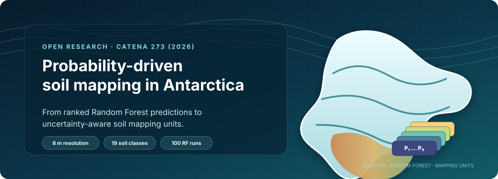
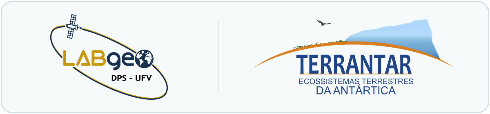
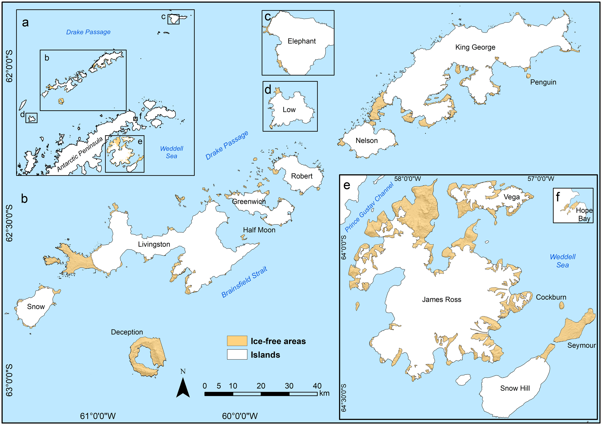
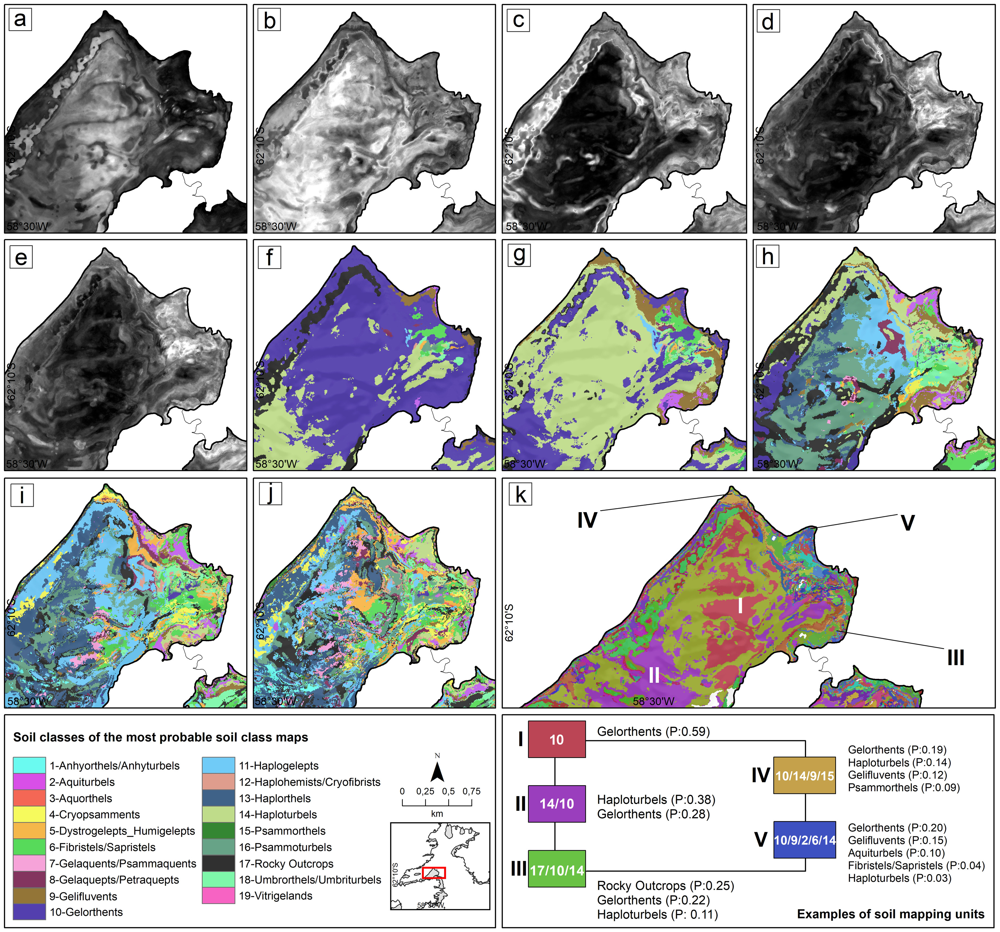

<p align="center">
  
</p>

<p align="center">
  
</p>

<p align="center">
  <a href="https://doi.org/10.1016/j.catena.2026.110421"></a> <a href="https://doi.org/10.5281/zenodo.19475873"></a>  
</p>

<p align="center">
  <a href="https://github.com/moquedace/antarctica_soil_class_mapping/actions/workflows/validate.yml"></a>
  <a href="LICENSE"></a>
  <a href="https://creativecommons.org/licenses/by/4.0/"></a>
</p>

<p align="center">
  <a href="#paper-first">Paper</a> ·
  <a href="#study-area">Study area</a> ·
  <a href="#at-a-glance">At a glance</a> ·
  <a href="#workflow">Workflow</a> ·
  <a href="#quick-start">Quick start</a> ·
  <a href="#code-map">Code</a> ·
  <a href="#documentation">Documentation</a> ·
  <a href="#data-products">Data products</a> ·
  <a href="#scope-and-execution-notes">Scope</a> ·
  <a href="#citation">Citation</a>
</p>

# Bridging soil mapping units and digital soil mapping through probability-driven machine learning

This repository contains the curated R workflow supporting the first digital soil-class maps for major ice-free areas of Maritime Antarctica and the northern Antarctic Peninsula. The framework combines legacy pedological observations, environmental covariates, repeated Random Forest modeling, ranked class probabilities, and the classical concept of soil mapping units to represent spatial uncertainty explicitly.

> **Canonical sources.** The peer-reviewed article is the source of record for the methods and interpretation. The complete spatial products are versioned and preserved on Zenodo. This code-only repository documents the computational sequence used in the study; it does not distribute source data or claim turnkey reproduction. Exploratory and test scripts are intentionally excluded.

## Paper first

**[Siqueira, Rafael G.](https://lattes.cnpq.br/9254221584773247); [Moquedace, Cássio M.](https://lattes.cnpq.br/4885480549870479); [Francelino, Márcio R.](https://lattes.cnpq.br/1335748426615308); [Schaefer, Carlos Ernesto G. R.](https://lattes.cnpq.br/0904177542323793); [Michel, Roberto F. M.](https://lattes.cnpq.br/9952967245812027); [Schmitz, Daniela](https://lattes.cnpq.br/5475207728890493); [Ferrari, Flávia R.](https://lattes.cnpq.br/5752420497152319); [Delpupo, Caroline](https://lattes.cnpq.br/9807469005020310); [Senra, Eduardo O.](https://lattes.cnpq.br/3457720664222888); [Palma, Heitor P.](https://lattes.cnpq.br/9803886320013379); [Krum, Daniel N.](https://lattes.cnpq.br/8618827674539051); [de Oliveira, Fábio S.](https://lattes.cnpq.br/8546459778894275); [Pereira, Thiago T. C.](https://lattes.cnpq.br/8278516582581479); [Lopes, Davi do V.](https://lattes.cnpq.br/0058947401153553); [Thomazini, André](https://lattes.cnpq.br/0119595657636544); [Gjorup, Davi F.](https://lattes.cnpq.br/9775159377586140); [Almeida, Ivan Carlos C.](https://lattes.cnpq.br/9045591206203235); [Fernandes-Filho, Elpídio Inácio](https://lattes.cnpq.br/9848935150180973). (2026).** Bridging soil mapping units and digital soil mapping through probability-driven machine learning: an uncertainty-aware framework for soil class prediction in Antarctica. *Catena, 273*, 110421. [https://doi.org/10.1016/j.catena.2026.110421](https://doi.org/10.1016/j.catena.2026.110421)

The study replaces a single deterministic class at each pixel with a structured, interpretable description of plausible soil classes. Ranked probabilities are accumulated until a 0.50 threshold is reached, producing mapping units with one to five soil components.

## Study area

<p align="center">
  
</p>

**Study area.** Major ice-free sectors of the South Shetland Islands, Elephant Island, Low Island, the James Ross Islands, and Hope Bay on the northern Antarctic Peninsula. Figure from [Siqueira et al. (2026)](https://doi.org/10.1016/j.catena.2026.110421), reproduced under [CC BY 4.0](https://creativecommons.org/licenses/by/4.0/); originally adapted from [Siqueira et al. (2024)](https://doi.org/10.1016/j.catena.2023.107677).

## At a glance

| Dimension | Published design |
|---|---|
| Study domain | Ice-free areas of Maritime Antarctica and northern Antarctic Peninsula |
| Observations | 965 classified soil profiles plus 40 rocky-outcrop observations |
| Prediction target | 19 individual or grouped Soil Taxonomy great-group classes |
| Spatial support | 8 m grid |
| Predictors | Soil properties, terrain attributes, geology, and Sentinel-2 covariates |
| Model | Probability-based Random Forest, 500 trees |
| Validation | 100 repeated 80:20 train/test splits; repeated 10-fold CV for tuning |
| Feature selection | Near-zero variance filter, correlation filter (`\|r\| > 0.95`), and RFE |
| Reported performance | Accuracy 0.43 · kappa 0.31 · balanced accuracy 0.61 · F1 0.44 |
| Uncertainty representation | Five ranked classes and probabilities, integrated into soil mapping units |

## Workflow

```mermaid
flowchart LR
    A[Legacy soil observations] --> D[Model-ready table]
    B[Soil, terrain, geology and Sentinel-2 covariates] --> C[8 m predictor stack]
    C --> D
    D --> E[NZV and correlation filters]
    E --> F[RFE feature selection]
    F --> G[100 Random Forest runs]
    G --> H[Independent test metrics]
    G --> I[Probability maps by class]
    I --> J[Median probability across runs]
    J --> K[Rank classes P1 to P5]
    K --> L[Accumulate probability to 0.50]
    L --> M[One- to five-component mapping units]
    M --> N[Generalized maps and statistics]
```



The full methodological correspondence between the article and the public scripts is documented in [Methods and code](pages/methods-and-code.md).

<details>
<summary><strong>Open the published methodological diagram</strong></summary>
<br>
<p align="center">
  
</p>

**Published workflow.** The complete analytical design links database assembly, covariate screening, repeated Random Forest modeling, class-probability maps, and the construction of one- to five-component soil mapping units. Figure from [Siqueira et al. (2026)](https://doi.org/10.1016/j.catena.2026.110421), reproduced under [CC BY 4.0](https://creativecommons.org/licenses/by/4.0/).
</details>

## Quick start

Install the three packages used directly by the curated public scripts:

```r
install.packages(c("caret", "dplyr", "terra"))
```

Place compatible observations and aligned covariate rasters according to the [input contract](scripts/README.md#where-your-data-enter), set the project root, and run the scripts in numerical order:

```r
options(antarctica.project_root = "path/to/antarctica_soil_class_mapping")

source("scripts/00_config.R")
source("scripts/01_prepare_training_data.R")
source("scripts/02_fit_rf_ensemble.R")
source("scripts/03_predict_class_probabilities.R")
source("scripts/04_rank_probabilities.R")
source("scripts/05_build_mapping_units.R")
source("scripts/06_validate_outputs.R")
```

This sequence is an adaptable implementation of the published logic, not a one-command reproduction of the Antarctic products. Source observations and covariates are not distributed.

### Published result

<p align="center">
  
</p>

**Published mapping units.** Ranked probabilities (a–e), corresponding soil classes (f–j), and the resulting probability-supported mapping units (k) for Western Admiralty Bay, King George Island. Figure from [Siqueira et al. (2026)](https://doi.org/10.1016/j.catena.2026.110421), reproduced under [CC BY 4.0](https://creativecommons.org/licenses/by/4.0/).

## Code map

```text
.
├── .github/workflows/              # Automated repository validation
├── assets/                         # Repository artwork
├── pages/                          # Methods, products, and execution context
├── scripts/                        # Compact, article-aligned workflow
│   ├── 00_config.R
│   ├── 01_prepare_training_data.R
│   ├── 02_fit_rf_ensemble.R
│   ├── 03_predict_class_probabilities.R
│   ├── 04_rank_probabilities.R
│   ├── 05_build_mapping_units.R
│   └── 06_validate_outputs.R
├── tools/                          # Documentation checks
├── CITATION.cff
├── DESCRIPTION
├── LICENSE
└── README.md
```

Start with the [script index and input contract](scripts/README.md). The compact sequence shows where users insert their own observations and aligned covariates, then follows those inputs through models, probability maps, ranked classes, and soil mapping units.

## Documentation

| Page | Purpose |
|---|---|
| [Script index and input contract](scripts/README.md) | Required user inputs, raster alignment rules, and the ordered execution sequence |
| [Methods and code](pages/methods-and-code.md) | Correspondence between the published method, conceptual figures, and curated scripts |
| [Data products](pages/data-products.md) | Zenodo archive inventory, checksums, class codes, and map-scale variants |
| [Computational provenance](pages/reproducibility.md) | Scope, software context, omissions, and interpretation boundaries |

## Data products

The complete 1.7 GB spatial release is available from [Zenodo record 19475873](https://zenodo.org/records/19475873) ([DOI: 10.5281/zenodo.19475873](https://doi.org/10.5281/zenodo.19475873)).

| Archive | Content | Size |
|---|---|---:|
| `probability_maps_per_soil_class.zip` | 19 class-specific median probability rasters | 879.8 MB |
| `probable_soil_classes.zip` | Five rasters containing the first- to fifth-ranked soil class | 151.7 MB |
| `probability_probable_soil_classes.zip` | Five probability rasters associated with the ranked classes | 316.3 MB |
| `final_maps.zip` | Raw, aggregated, and scale-generalized vector soil mapping units | 314.7 MB |
| `number_classes_per_mapping_unit.zip` | Number of components (1–5) in each mapping unit | 3.6 MB |

File-level interpretation, scale variants, and checksums are summarized in [Data products](pages/data-products.md).

## Scope and execution notes

The public release deliberately separates three layers:

1. **Article:** canonical methods, results, and interpretation.
2. **GitHub:** curated analytical code and the sequence corresponding to the published workflow.
3. **Zenodo:** versioned, citable, large spatial products.

The source observations, environmental covariates, intermediate files, and local processing environment are not distributed here. The scripts therefore serve primarily as transparent computational provenance, while exposing clear input locations so readers can adapt the sequence to compatible data of their own. See [Computational provenance and execution context](pages/reproducibility.md).

## Key contribution

The framework preserves uncertainty without abandoning a cartographic language familiar to soil survey. Instead of forcing every pixel into one unequivocal class, it retains the most plausible alternatives and converts them into homogeneous mapping units whose components are supported by cumulative probability.

This provides a transferable bridge between digital soil mapping and conventional pedological interpretation in remote, data-scarce, and environmentally complex landscapes.

## Citation

If you use the code, cite both the article and the spatial dataset. Machine-readable metadata are available in [`CITATION.cff`](CITATION.cff).

> [Siqueira, Rafael G.](https://lattes.cnpq.br/9254221584773247); [Moquedace, Cássio M.](https://lattes.cnpq.br/4885480549870479); [Francelino, Márcio R.](https://lattes.cnpq.br/1335748426615308); [Schaefer, Carlos Ernesto G. R.](https://lattes.cnpq.br/0904177542323793); [Michel, Roberto F. M.](https://lattes.cnpq.br/9952967245812027); [Schmitz, Daniela](https://lattes.cnpq.br/5475207728890493); [Ferrari, Flávia R.](https://lattes.cnpq.br/5752420497152319); [Delpupo, Caroline](https://lattes.cnpq.br/9807469005020310); [Senra, Eduardo O.](https://lattes.cnpq.br/3457720664222888); [Palma, Heitor P.](https://lattes.cnpq.br/9803886320013379); [Krum, Daniel N.](https://lattes.cnpq.br/8618827674539051); [de Oliveira, Fábio S.](https://lattes.cnpq.br/8546459778894275); [Pereira, Thiago T. C.](https://lattes.cnpq.br/8278516582581479); [Lopes, Davi do V.](https://lattes.cnpq.br/0058947401153553); [Thomazini, André](https://lattes.cnpq.br/0119595657636544); [Gjorup, Davi F.](https://lattes.cnpq.br/9775159377586140); [Almeida, Ivan Carlos C.](https://lattes.cnpq.br/9045591206203235); [Fernandes-Filho, Elpídio Inácio](https://lattes.cnpq.br/9848935150180973). (2026). Bridging soil mapping units and digital soil mapping through probability-driven machine learning: an uncertainty-aware framework for soil class prediction in Antarctica. *Catena, 273*, 110421. [https://doi.org/10.1016/j.catena.2026.110421](https://doi.org/10.1016/j.catena.2026.110421)

Spatial products: [https://doi.org/10.5281/zenodo.19475873](https://doi.org/10.5281/zenodo.19475873)

## License

The curated R code is released under the [MIT License](LICENSE). Article figures and associated scientific content retain their stated source attribution and are reproduced under [CC BY 4.0](https://creativecommons.org/licenses/by/4.0/). The MIT License does not replace or extend the license of the article figures, third-party data, or Zenodo products.

## Contact

For questions about the analysis or spatial products, use the corresponding-author details in the article or open a focused GitHub issue describing the script, input, and error involved.
