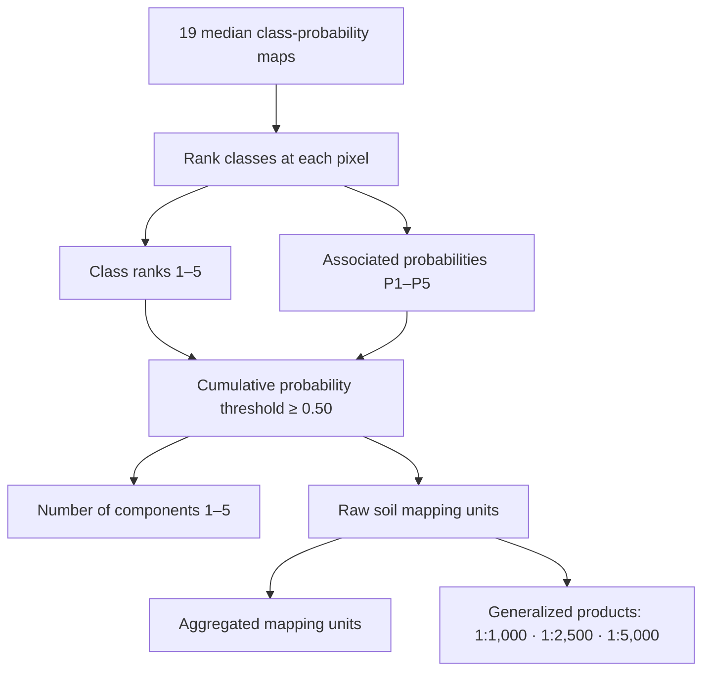

# Data products

[← Back to the project overview](../README.md)

The complete spatial release is archived as [Zenodo record 19475873](https://zenodo.org/records/19475873), DOI [10.5281/zenodo.19475873](https://doi.org/10.5281/zenodo.19475873). Large generated files are not duplicated in GitHub.

## Archive inventory

| Archive | Description | Size | MD5 |
|---|---|---:|---|
| `probability_maps_per_soil_class.zip` | Nineteen continuous GeoTIFFs containing the median probability of each soil class across 100 runs | 879.8 MB | `5359d4ed0d81b410536560e3abd8556d` |
| `probable_soil_classes.zip` | Five categorical GeoTIFFs containing class ranks 1–5 | 151.7 MB | `e2d1a4fe96e65982bdcda93165799f73` |
| `probability_probable_soil_classes.zip` | Five GeoTIFFs containing the probability associated with each ranked class | 316.3 MB | `71856627caf584d8df4d504dbcc6f352` |
| `final_maps.zip` | Vector soil mapping units, including raw, aggregated, and generalized versions | 314.7 MB | `a333890c88f54f56ba4dcb1f40e850d2` |
| `number_classes_per_mapping_unit.zip` | A categorical GeoTIFF containing the number of components (1–5) in each mapping unit | 3.6 MB | `dff49d60887bd6f924d35c207d4de19d` |

## Product logic

## Soil-class codes

The categorical rank rasters use values 1–19. Their labels are:

1. Anhyorthels / Anhyturbels
2. Aquiturbels
3. Aquorthels
4. Cryopsamments
5. Dystrogelepts / Humigelepts
6. Fibristels / Sapristels
7. Gelaquents / Psammaquents
8. Gelaquepts / Petraquepts
9. Gelifluvents
10. Gelorthents
11. Haplogelepts
12. Haplohemists / Cryofibrists
13. Haplorthels
14. Haploturbels
15. Psammorthels
16. Psammoturbels
17. Rocky Outcrops
18. Umbrothels / Umbriturbels
19. Vitrigelands

The vector products include class names, class codes, polygon area, and mapping-unit composition. The raw product with probabilities also carries mean probability and standard deviation for each component.

## Scale variants

Files ending in `_1000`, `_2500`, and `_5000` are generalized according to the minimum mappable area associated with the indicated map scale. Use the non-generalized product when analysis requires the original 8 m prediction support; use generalized products for cartographic communication at the named scales.

