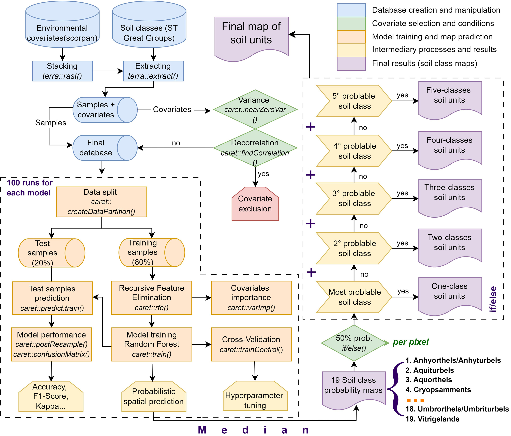
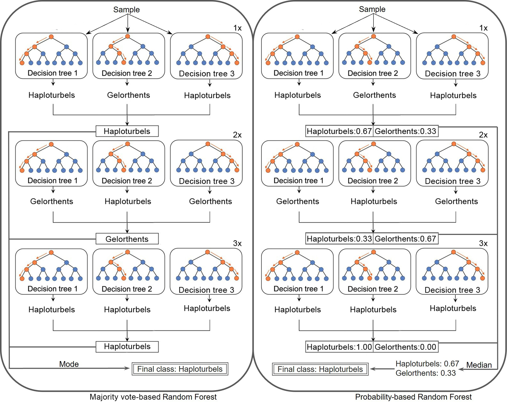
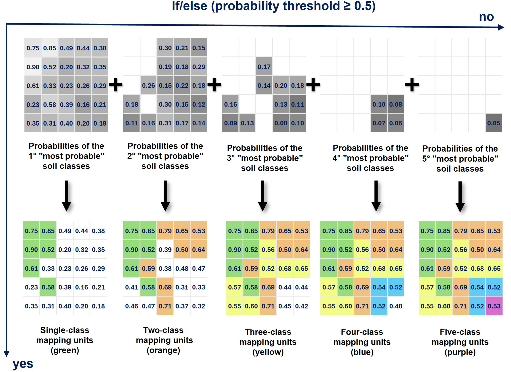

# Methods and code correspondence

[← Back to the project overview](../README.md)

This page maps the published method to the curated scripts. The article is the source of record whenever a local working script contains later experiments, alternative sampling designs, or unfinished branches.

## Release rule

A script is part of the public workflow only when its purpose is directly supported by the article's methods, figures, tables, or archived Zenodo products. The public release excludes balance experiments, cLHS experiments, post-publication rewrites, and other test variants that did not generate the reported results.

## Published analytical workflow

  

The published workflow connects database assembly and covariate screening to repeated model fitting, pixelwise probability prediction, and the construction of one- to five-component mapping units. The compact scripts below preserve this analytical sequence without exposing local data or experimental branches. Figure from [Siqueira et al. (2026)](https://doi.org/10.1016/j.catena.2026.110421), reproduced under [CC BY 4.0](https://creativecommons.org/licenses/by/4.0/).

## Method-to-code map

| Published step | Compact public script | Main output |
|---|---|---|
| Declare paths, target classes, CRS, repetition count, and probability threshold | [`00_config.R`](../scripts/00_config.R) | Shared configuration |
| Extract soil observations from the aligned 8 m covariate stack | [`01_prepare_training_data.R`](../scripts/01_prepare_training_data.R) | Model-ready table of classes and covariates |
| Filter predictors, run RFE, and fit 100 RF models using repeated train/test divisions | [`02_fit_rf_ensemble.R`](../scripts/02_fit_rf_ensemble.R) | Fitted ensemble and independent-test metrics |
| Predict per-class vote proportions and calculate pixelwise medians across runs | [`03_predict_class_probabilities.R`](../scripts/03_predict_class_probabilities.R) | Median probability map for each soil class |
| Rank the first through fifth most probable classes and retain their probabilities | [`04_rank_probabilities.R`](../scripts/04_rank_probabilities.R) | Five class ranks and five probability ranks |
| Accumulate probabilities to 0.50 and encode one- to five-component mapping units | [`05_build_mapping_units.R`](../scripts/05_build_mapping_units.R) | Component count, mapping-unit codes, and polygons |
| Check common geometry, layer counts, and published value domains | [`06_validate_outputs.R`](../scripts/06_validate_outputs.R) | Structural validation messages |

## Published model specification

### Why probabilities are retained

  

Majority voting retains only the winning class from each run. The probability-based implementation retains the class vote proportions and summarizes them across repeated runs, preserving plausible alternatives that would otherwise disappear.

- Target: 19 individual or grouped soil classes at the Soil Taxonomy great-group level, including rocky outcrops.
- Training information: 965 complete soil profiles and 40 rocky-outcrop observations.
- Split: stratified 80% training and 20% testing, repeated 100 times.
- Predictor screening: near-zero variance removal followed by a correlation threshold of `|r| > 0.95`.
- Feature selection: Recursive Feature Elimination on the training data.
- Learner: Random Forest through `caret`, using 500 trees and `nodesize = 1`.
- Hyperparameter tuning: five candidate `mtry` values with three-times repeated 10-fold cross-validation.
- Spatial prediction: per-class vote proportions, generated as probability rasters.
- Ensemble summary: pixelwise median probability across the 100 runs.
- Mapping-unit rule: add ranked class probabilities until cumulative probability reaches or exceeds 0.50; use at most five components.

### From ranked probabilities to mapping units

  

At each pixel, classes are ordered by probability and accumulated until the 0.50 threshold is met. Pixels therefore receive one to five plausible components depending on how concentrated or diffuse the modeled probability distribution is. Conceptual figures from [Siqueira et al. (2026)](https://doi.org/10.1016/j.catena.2026.110421), reproduced under [CC BY 4.0](https://creativecommons.org/licenses/by/4.0/).

## Interpretation boundary

The map is not a deterministic statement that one soil class occupies every pixel. Each final mapping unit is an association of plausible soil components derived from ranked class probabilities. Model uncertainty, class imbalance, sparse observations, and unresolved local variability remain part of the interpretation.

## Why the public code is compact

The working analysis contained tiled processing, file-specific post-processing, diagnostics, and experimental branches. The public scripts retain the principal transformations and input/output contracts needed to understand or adapt the method. They are not verbatim execution logs and do not include alternative experiments that were not part of the published result.
